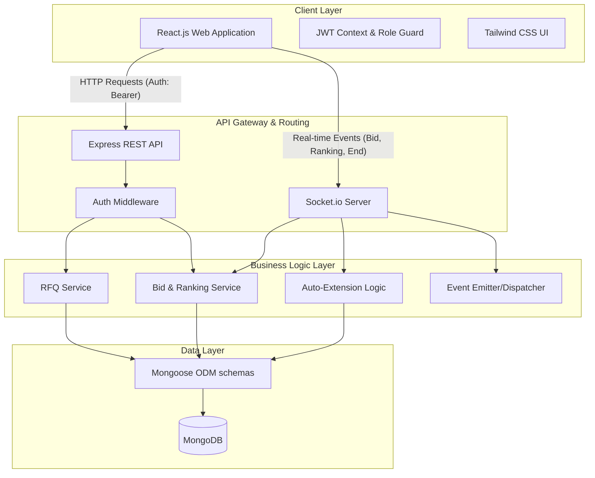

# System Architecture & High-Level Design (HLD)

The British Bidding System is built on the **MERN (MongoDB, Express, React, Node.js)** stack, augmented with **Socket.io** for real-time, bi-directional event communication. This architecture allows the platform to maintain low-latency updates for auction bid updates, real-time ranking adjustments, and timer extensions.

## Architecture Diagram

---

# Database Schema Design

The datastore utilizes **MongoDB**, a NoSQL database. Documents are managed natively using **Mongoose ODM**. Below is the logical data layout based on the system models.

## `users` Table/Collection
Stores both Buyer and Bidder accounts.
| Field | Type | Attributes | Description |
| :--- | :--- | :--- | :--- |
| `_id` | ObjectId | Primary Key | Unique document identifier |
| `name` | String | Required | Full name of the user/organization |
| `email` | String | Required, Unique | Login email address |
| `password` | String | Required | Bcrypt-hashed password |
| `role` | String | Enum | `'BUYER'` or `'BIDDER'` |
| `createdAt` | Date | Auto | Record creation timestamp |

## `rfqs` Table/Collection
Stores the configuration, logistics, and constraints for auctions.
| Field | Type | Attributes | Description |
| :--- | :--- | :--- | :--- |
| `_id` | ObjectId | Primary Key | Unique RFQ ID |
| `name` | String | Required | Summary/Name of the auction |
| `status` | String | Enum | `'UPCOMING'`, `'LIVE'`, `'ENDED'`, `'AWARDED'` |
| `startTime` | Date | Required | When bidding opens |
| `endTime` | Date | Required | When bidding ideally closes (dynamic) |
| `maxEndTime` | Date | Required | Absolute/Hard deadline boundary |
| `pickupLocation` | String | Required | Logistics origin |
| `dropLocation` | String | Required | Logistics destination |
| `serviceDate` | Date | Default: Now | Date of execution request |
| `triggerWindow` | Number | Required | Minutes before close triggering auto-extension |
| `extensionDuration`| Number | Required | Duration (mins) timer extends |
| `extensionTriggerType` | String | Enum | `'ANY_BID'`, `'RANK_CHANGE'`, `'L1_CHANGE'` |
| `createdBy` | ObjectId | Ref `users` | Buyer who initiated the RFQ |
| `selectedBidderId` | ObjectId | Ref `users` | Winner user ID (when Awarded) |
| `currentLowestBid` | Number | Optional | Optimistic caching of the leading lowest bid |
| `endedEarly` | Boolean | Default: false | If manually terminated by buyer |

## `bids` Table/Collection
Captures all quotations placed during an active RFQ sequence.
| Field | Type | Attributes | Description |
| :--- | :--- | :--- | :--- |
| `_id` | ObjectId | Primary Key | Unique Bid ID |
| `rfqId` | ObjectId | Ref `rfqs`, Index | The auction this bid belongs to |
| `bidder` | ObjectId | Ref `users` | The supplier placing the bid |
| `freightCharges` | Number | Required | Base shipping cost |
| `originCharges`| Number | Required | Origin handling charges |
| `destinationCharges` | Number | Required | Destination handling costs |
| `totalBidValue`| Number | Required | `freight + origin + destination` |
| `transitTime` | Number | Required | Delivery timeframe in days |
| `quoteValidity`| Date | Required | Expiration date of quoted metrics |
| `rank` | Number | Default: 0 | Evaluated placement of bid against competition |
| `createdAt` | Date | Auto | Timestamp of bid submission |

## `activitylogs` Table/Collection
Stores an audit log of pivotal events tied to isolated RFQs.
| Field | Type | Attributes | Description |
| :--- | :--- | :--- | :--- |
| `_id` | ObjectId | Primary Key | Unique Log entry UUID |
| `rfqId` | ObjectId | Ref `rfqs`, Index | Subject auction |
| `type` | String | Enum | `'BID_PLACED'`, `'AUCTION_EXTENDED'`, `'RANK_UPDATE'` |
| `message` | String | Required | Human-readable log breakdown |
| `details` | Object | Optional | JSON payload with metrics associated to the log |
| `timestamp`| Date | Default: Now | Time of occurrence |
